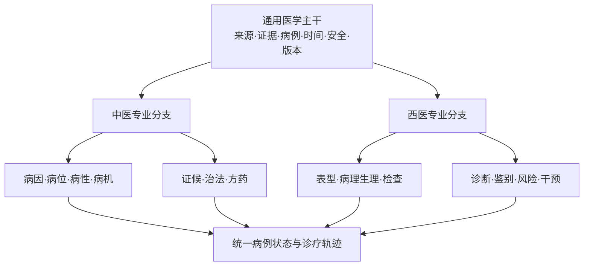
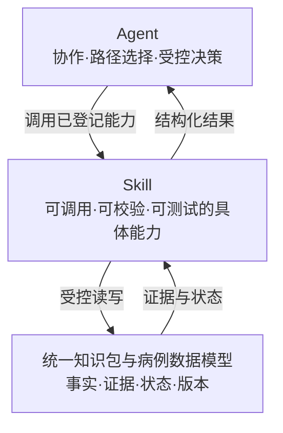
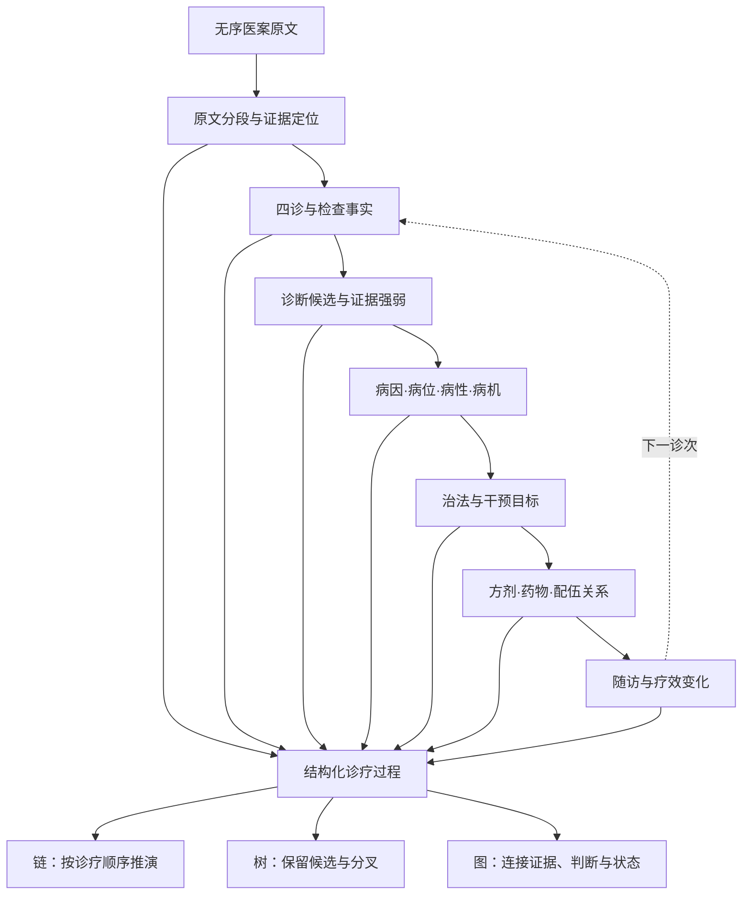
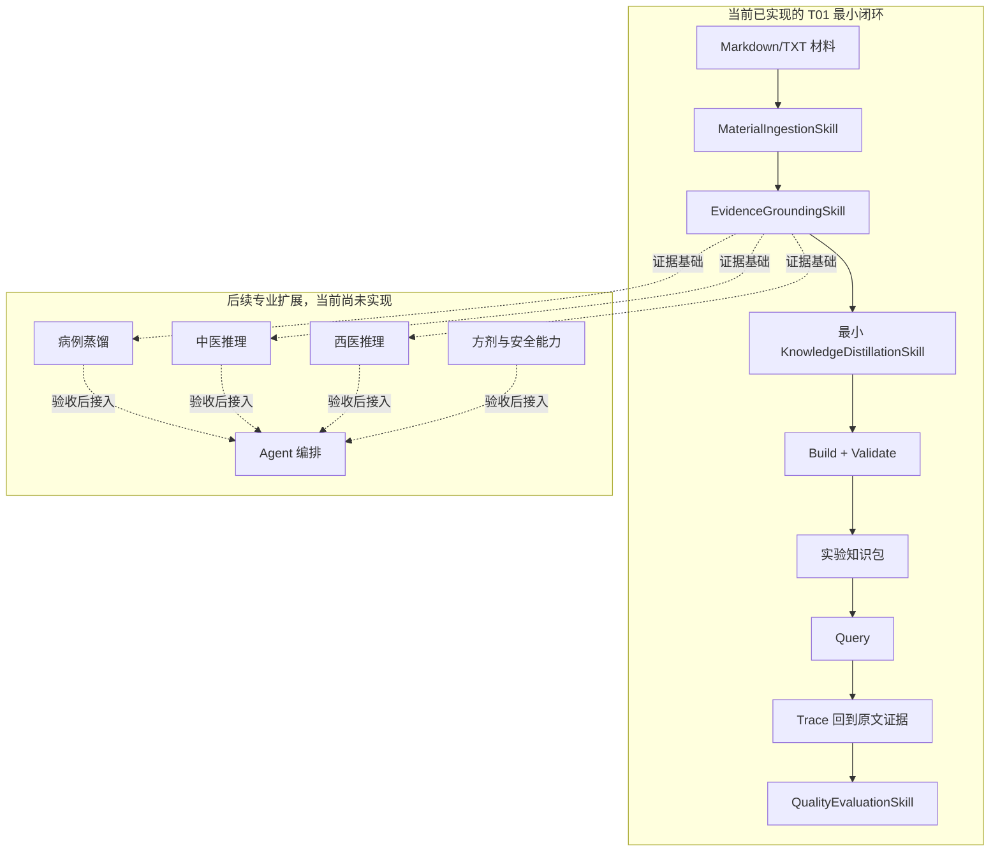

# 项目更新报告 2026-09-28

## 本周结论

这是项目首份周报，以 2026-09-23 的 `first commit`（`7d0a620`）为首次基线。

项目已从“只有需求、设计和导师参考资料”，推进到“设计边界基本稳定、任务系统已建立、T01 最小代码骨架可运行”。当前仍处于阶段 01，尚未进入正式中医知识蒸馏。

## 相比首次提交完成的工作

### 1. 收敛中西医平台总体架构

完成了“通用医学主干 + 中医专业分支 + 西医专业分支”的架构设计。通用主干统一管理来源、证据、病例、时间、干预、结局、安全、审核和版本；中医分支保留病因、病位、病性、病机、证候、治法和方药等语义；西医分支保留表型、病理生理、诊断、鉴别、检查、风险和干预等语义。

这样设计是因为中西医共享材料处理和证据治理需求，但专业理论不能强行合并。通用能力集中建设可以减少重复开发，专业能力分叉则可以防止两套医学语义相互覆盖。当前先以中医病机验证平台，不会把底层框架锁死为纯中医项目。



### 2. 固定 Agent、Skill 和数据层职责

项目最高层执行原则已经明确为：



Agent 负责拆分任务、选择能力、组织流程和受控决策；Skill 负责可复用、可测试的具体功能；医学事实、证据和病例状态统一保存在数据层。Agent 不直接保存知识，Skill 也不能只是一份提示词。

这项分层的作用是让同一项医学能力能够被命令行、Web、MCP、Codex 或其他智能体重复调用和单独测试。以后即使更换模型或运行环境，也不需要重写核心医学逻辑。

### 3. 确定 Agent 与 Skill 的建设规模

总体设计定义了 6 类 Agent 职责和 11 类核心 Skill 家族，但不要求一次性全部部署。

MVP 计划在基础 Skill 稳定后，先启用编排、知识构建、证据评审 3 个逻辑 Agent；中医、西医和安全治理角色在对应专业能力通过验收后再启用。导师提出的“数十个智能体协作”保留为最终扩展方向，只有出现独立权限、独立状态、并行任务或独立评价需要时才继续拆分。

这样安排可以先验证真实协作链路，避免为了数量制造职责重复、上下文传递损耗和难以定位的错误。

11 类 Skill 家族覆盖材料摄取、证据定位、知识蒸馏、病例蒸馏、中医推理、西医推理、安全门、方剂、知识包构建校验、知识包查询和质量评价。当前只实现了其中 6 个最小基础 Skill，专业医学 Skill 尚未开始。

### 4. 吸收“医案分析”材料中的方法

导师新材料中的以下内容已经进入整体设计：

- 药物四气五味、归经、功效和配伍关系需要进入方剂与药物结构，不能只保留普通文本；
- 医案不能只记录最终诊断和处方，还需要细化四诊证据、诊断、病机、治法、方药和诊次变化；
- 无序文本需要先转换为可审计的结构化过程，再按用途生成链、树或图；
- 同一套处理模式可以扩展到教材、医家经验、方剂和其他医学材料；
- 未来由多个智能体协作完成材料处理、证据核验、专业分析和质量评审。

项目据此增加了临床认知图、方剂药物层、多诊次状态轨迹和多智能体协作方向。为了保证结果可检查，平台保存的是“证据—判断—关系—结果”的结构化中间状态，而不是不可核验的模型内部思维过程。

这些内容目前属于已经固化的设计，尚未实现为完整医案蒸馏能力。



图中链、树和图是同一份结构化证据数据的不同视图，不重复生成相互冲突的事实副本。

### 5. 建立统一知识包与证据规范

这套规范用于保证蒸馏结果能够校验、查询、组合和重新生成，避免产出一批无法确认来源的自由文本或临时 JSON。

| 新增规范 | 具体作用 |
| --- | --- |
| 来源与证据必须保留 | 每条知识和判断都能回到原文及位置，便于审核和纠错 |
| 缺失字段保留为 `null` | 区分“没有信息”和“空字符串”，防止模型猜测补全 |
| 同 key 异义、不同 key 同义、重复 key、未映射字段不得丢失 | 保存原始数据和映射状态，避免为了满足 Schema 损坏材料 |
| 原文、纠正候选、模型结果和人工确认分离 | 防止 OCR 或模型修改覆盖原始证据 |
| 多段内容可以整理，但必须引用全部来源片段 | 保证综合结论仍能逐项追溯 |
| 记录协议、Skill、模型、规则和知识包版本 | 支持结果复现，并能判断差异来自哪个环节 |
| Build、Validate、Query、Trace、Round-trip 同时验收 | 不只验证“能生成”，还验证“能校验、能使用、能回到证据” |

统一知识包还会配套项目级“说明书”，集中解释规范字段、语义、映射状态和规则版本。单个知识包只声明使用哪个协议版本，不能自行改变相同字段的含义。

### 6. 建立项目任务系统和执行规范

新增 `tasks` 任务系统，把项目拆分为 6 个阶段，并区分终极需求、当前任务、下一任务和后续思路。只有当前阶段的 `CURRENT_TASK.md` 是正式可执行任务；下一任务只说明衔接关系；未来阶段在真正开始前必须根据届时的代码和需求重新评审。

同时新增 `AGENTS.md` 和 `tasks/STATE.md`。以后在其他环境接入 LLM 后询问“下一步做什么”，AI 必须先读取项目状态、检查前置产物，再返回唯一当前任务，不能依赖聊天记忆，也不能把未来设想当成当前能力。

这套规范的作用是让项目从“走一步看一步”变为由仓库内需求、前置条件和验收标准驱动，同时为尚未确定的技术方案保留调整空间。

另外增加了两项内容治理规则：

- `docs` 默认只读，用来保存导师原始资料，避免开发过程中改写原始依据；
- `log` 只能在用户明确要求时更新，避免自动周报与实际进度不一致。

### 7. 完成 T01 技术选型和开发环境

| 技术 | 当前用途 | 选择原因 |
| --- | --- | --- |
| CPython 3.13 | 核心运行语言 | 适合数据处理、模型调用和后续医学算法开发，生态完整且迭代速度快 |
| uv | Python、虚拟环境、依赖和构建管理 | 一个工具统一管理环境，并通过 `uv.lock` 锁定依赖，减少不同机器间的环境差异 |
| Pydantic 2 | 输入输出模型和运行时校验 | 同一份模型既能执行 Python 校验，也能导出 JSON Schema，便于 MCP、REST 和其他语言复用 |
| JSON Schema | Skill 的语言无关接口契约 | 让外部 Agent 和工具明确字段要求，并能检查接口是否出现不兼容变化 |
| httpx | 真实 LLM 的 HTTP 调用 | 避免把核心代码绑定到某个厂商 SDK，便于接入不同 OpenAI-compatible 服务 |
| pytest | 单元、契约和端到端测试 | 自动验证 Schema、错误语义、幂等性和完整闭环，减少后续扩展产生回归 |
| FakeModel | 默认离线模型替身 | 不使用网络和密钥也能稳定复现结果，防止模型随机性掩盖代码问题 |
| OpenAI-compatible 适配器 | 可选真实模型接入 | 业务 Skill 不直接依赖供应商，更换模型时只需要替换适配层 |
| `src` 结构与 `uv_build` | Python 包组织和构建 | 防止测试误引用仓库源码，并为后续生成可安装包保留标准路径 |

当前机器已经形成 Windows x64、CPython 3.13.15、uv 0.12.18 的开发基线，精确依赖由 `uv.lock` 管理。真实 LLM 配置放在被 Git 忽略的本地文件中，密钥不得进入代码、日志、测试、知识包或报告。

### 8. 实现第一版可运行项目骨架

已经实现 Skill manifest、注册表、版本选择、统一 Runner、中立 Facade、统一结果信封、命令行入口和模型适配层，并实现以下 6 个最小 Skill：

1. `MaterialIngestionSkill`：读取 Markdown/TXT 测试材料；
2. `EvidenceGroundingSkill`：生成带原文和位置的稳定证据；
3. `KnowledgeDistillationSkill`：验证结构化知识候选和证据引用；
4. `KnowledgePackageBuildValidateSkill`：构建并校验实验知识包；
5. `KnowledgePackageQuerySkill`：按稳定身份查询并回到来源证据；
6. `QualityEvaluationSkill`：执行确定性的结构、证据和完整性检查。

当前已经跑通“材料 → 证据 → 知识候选 → 实验知识包 → 查询 → 证据回溯”的最小路径。这个闭环的作用是先验证接口、Schema 和数据流，避免专业蒸馏完成后才发现知识包无法消费。当前蒸馏逻辑仅用于验证结构，不代表已经具备可靠的中医知识抽取能力。



实线部分是当前能够运行的最小闭环；虚线部分是后续方向，不能视为已经实现。

### 9. 设计 Codex、MCP 等外部适配层

项目采用“核心平台独立运行，外部环境使用薄适配层”的方案：

```text
Codex Skill / 其他智能体工作流
  → MCP、REST 或进程内适配器
  → 中立 Facade
  → Skill Registry 与 Runner
  → 知识包、证据和质量能力
```

这样设计是因为 Codex、MCP 或某个模型平台以后都可能变化，医学处理能力不能与单一宿主绑定。未来 Codex Skill 只描述何时调用工具和如何处理结果，MCP 负责暴露结构化工具、权限和安全信息，真正的医学逻辑仍由平台 Skill 实现。

目前已经完成接口边界和契约设计，尚未实现 MCP 服务或 Codex 插件。

### 10. 明确当前执行顺序和能力边界

- 当前正式任务为 T01“可调用 Skill 基础与最小知识闭环”，状态仍为 `in_progress`；
- T02“中医知识与病例蒸馏 Skill 及金标准闭环”仅为草案，必须等待 T01 验收通过后重新评审；
- 当前不允许把设计中的 Agent、专业医学 Skill、数据库、MCP、Web 或正式知识包描述为已实现；
- `docs` 只作为参考资料，不直接修改，也不直接当作正式知识或训练数据；
- 周报禁止自动更新，只有用户明确要求时才能修改。

执行顺序被固定为“先实现 Skill、Schema、校验、查询和证据回溯，再制作人工金标准，最后才开始正式知识蒸馏”。这项限制用于防止先生产大量格式不统一、证据不完整的数据，之后再花费更高成本返工。

## 已验证结果

- 项目工作区在生成本报告前无未提交改动；
- 2026-09-28 使用项目虚拟环境复跑自动测试：`5 passed`；
- 现有离线测试不依赖真实 LLM 密钥；
- 从首次提交到当前 HEAD，共增加 2 个提交，Git 统计为 115 个文件发生变化、增加 4116 行、删除 121 行。

## 当前产物

- 完整度较高的产品、数据、Skill、Agent、适配层和实施路线设计；
- 可指导其他 AI 读取项目状态并返回唯一当前任务的任务系统；
- uv 管理的 CPython 3.13 项目环境和依赖锁文件；
- 可运行的 T01 离线最小骨架与 6 个基础 Skill；
- 可生成、校验、查询并回溯证据的实验知识包；
- 5 项自动化测试。

## 未完成与风险

- 尚未完成真实 LLM 在线冒烟验收；
- Schema 导出、完整运行记录、字段歧义处理和干净环境重建验收仍需补齐；
- 当前知识蒸馏仅验证结构和调用协议，不代表已具备可靠的中医语义抽取能力；
- 当前材料摄取只覆盖最小文本格式，尚不支持 PDF、DOCX、OCR 和批处理；
- Codex/MCP 目前只有适配契约，尚无实际 MCP 服务或 Codex 插件；
- Agent、LadybugDB、REST/Web、正式知识包、正式金标准和后训练资产均尚未实现。

## 统计范围

- 基线：`7d0a620`，2026-09-23，`first commit`；
- 截止：`743b4cf`，2026-09-24，及 2026-09-28 生成报告前的工作区；
- 数据来源：Git 提交历史、首次提交文件树、当前任务状态、阶段任务文档和本次自动测试结果；
- 本报告只统计可核验的仓库产物，不把未来设计写成已实现能力，也不记录任何本地密钥信息。
