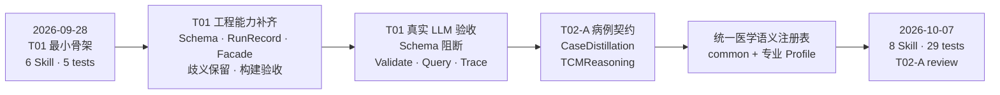
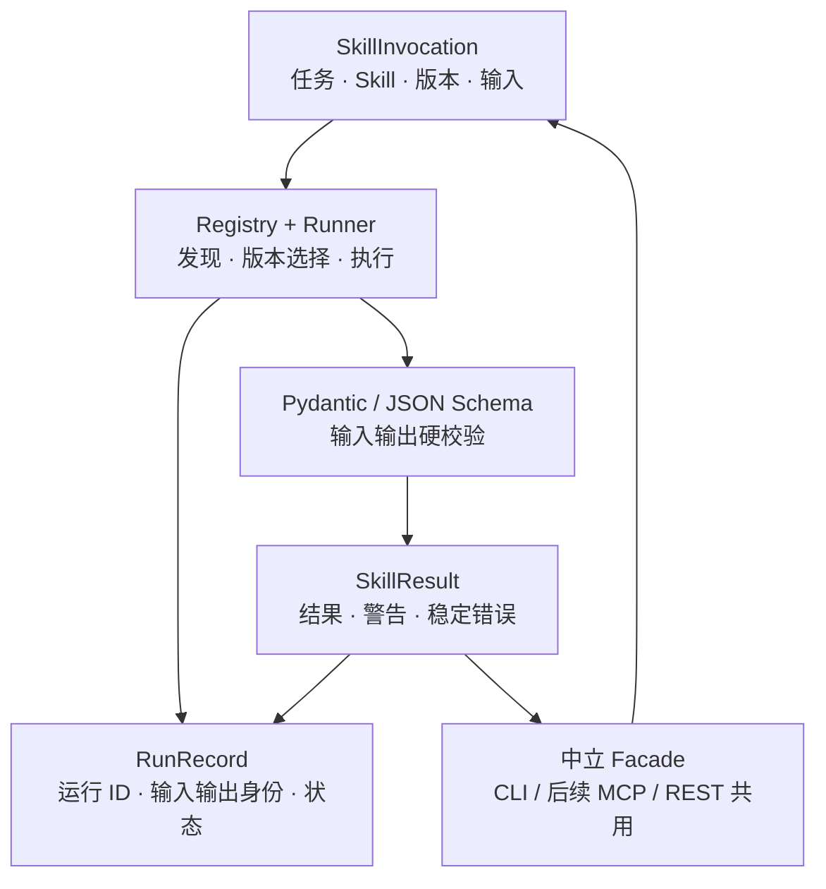
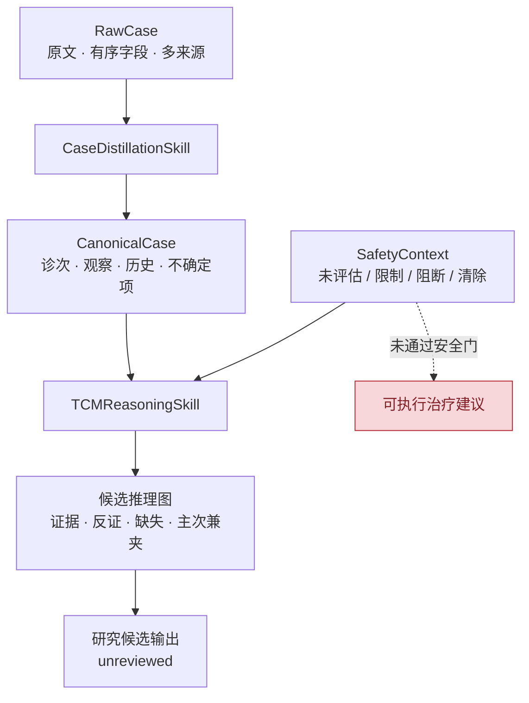
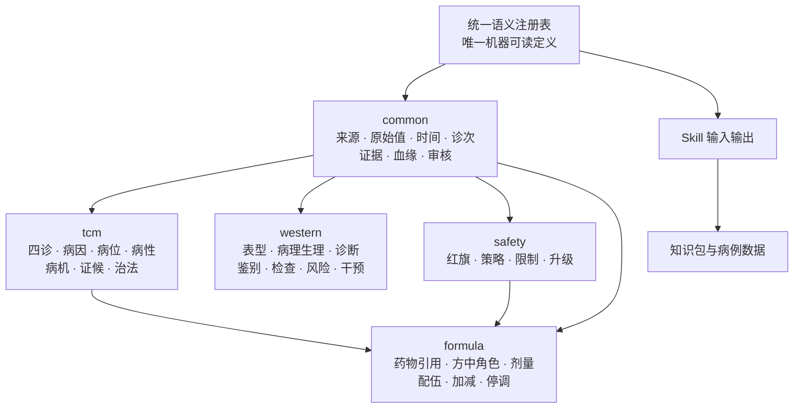

# 项目周报 2026-10-07

## 本周结论

相比 2026-09-28 周报，项目已从“阶段 01 最小骨架可运行”推进到“阶段 01 完整验收完成，阶段 02 的病例与中医病机契约基线已实现并进入评审”。本周期没有开始正式教材或医案批量蒸馏，重点是先补齐可调用 Skill、版本化 Schema、真实 LLM 验收、病例数据契约、专业语义分流和安全边界，确保后续蒸馏产生的数据能够保持原文、通过校验并追溯到证据。

当前共登记 8 个可调用 Skill，命令行入口由 9 个增加到 10 个，完整离线回归由上周的 5 项增加到 29 项。T01 已完成并经用户确认；T02-A 的软件实现和自动检查已通过，但医学金标准、教材证据和专家审核尚未完成，因此状态保持 `review`。

## 相比上周的变化

### 1. 完成 T01 工程闭环与正式技术验收

上周已经能够运行“材料—证据—知识候选—实验知识包—查询—证据回溯”的最小路径，但 Schema 快照、完整运行记录、字段歧义、构建物检查和真实模型验收仍未完成。本周期补齐并验收了这些能力，T01 已从 `in_progress` 更新为 `done`。

主要增加：

- 导出并固化 `schemas/t01/`，保存公共数据模型、6 个 Skill 的输入输出 Schema、manifest 和文件校验索引；
- 为每次 Skill 调用建立唯一 `RunRecord`，同时保存稳定输入、输出内容身份，区分“内容是否相同”和“是不是同一次运行”；
- 完善中立 Facade，统一提供 Skill 描述、调用、包校验、查询、证据回溯和运行记录查询；
- 统一结构化错误语义，使未知 Skill、版本不支持、依赖缺失、模型输出不符合 Schema 等情况可以被外部 Agent 稳定识别；
- 对 wheel、sdist 和独立安装环境进行了验收，确认安装包包含运行代码、Skill 描述和 Schema 所需资源，不包含本地密钥与缓存目录。

采用 Pydantic 2 和 JSON Schema，是为了让同一份契约既能在 Python 运行时强校验，又能被未来 MCP、REST、Codex 或其他语言客户端读取。增加 RunRecord 和内容身份，是为了让后续知识包差异能够追溯到具体输入、Skill 版本和运行，而不是只留下无法复现的最终文本。

### 2. 完成真实 LLM 本地配置与在线验收

新增唯一的本地 LLM 配置入口 `config/llm.local.toml`。真实 API 地址、模型名和密钥只由运行时读取，该文件被 Git 忽略；仓库只提交示例配置与使用说明。配置不完整时返回稳定错误，不会带着空配置发起网络请求。

真实 OpenAI-compatible 模型已完成两层验收：

1. `llm-smoke` 验证连通性和最小 JSON Schema 输出；
2. 真实模型进入最小流水线，生成实验知识候选，再经过知识包构建、Validate、Query 和 Trace。

验收中实际出现过一次模型输出不符合 `GeneratedKnowledgePayload` 的情况，系统返回 `OUTPUT_SCHEMA_INVALID` 并在构建知识包前终止；重新调用后完整闭环通过。这说明外部模型具有真实非确定性，也验证了“模型输出必须先通过 Schema，失败不得留下可用半成品”的设计确实生效。

选择 OpenAI-compatible 适配层而不是把业务代码绑定到某个厂商 SDK，是为了让后续更换模型服务时只调整适配器。默认测试仍使用确定性 FakeModel，从而避免网络、额度和模型随机性影响日常回归。

### 3. 强化原始数据保真、歧义处理与证据回溯

本周期把上周文档中的数据保真要求落到了代码和测试：

- 原始字段改为有序记录，允许同一个 key 多次出现；
- 重复 key、同 key 异义、不同 key 同义和未映射字段都保留原值、出现次序、来源路径和映射状态；
- 多段内容可以合并成一条知识候选，但必须保存全部证据引用；
- 实验知识包增加 `raw_fields.jsonl` 和 `runs.jsonl`，并返回稳定质量警告；
- 包校验、查询和 Trace 会检查证据引用，损坏包不能继续伪装成有效结果。

采用 JSONL 保存重复字段和运行记录，是因为普通 JSON 对象会在读取前覆盖同名 key，无法满足“歧义不能丢失”的要求。把原始值、规范候选和人工确认分开，是为了防止 OCR、模型或映射结果反向覆盖原始材料。

### 4. 评审并实现 T02-A 病例与病机推理契约

T02 没有直接开始整书蒸馏，而是拆成 T02-A、T02-B 和后续扩展。当前只实施了不依赖新增书籍的 T02-A：先验证病例契约、专业 Skill 接口、证据边界和安全阻断，固定版本教材与人工金标准留到 T02-B 重新评审。

本周期新增两个可登记、可调用、可测试的确定性基线 Skill：

| Skill | 已实现用途 | 当前边界 |
| --- | --- | --- |
| `case-distillation` `0.3.0` | 将人工登记的 RawCase 转换为 CanonicalCase，保留诊次、观察、历史记录、不确定项、原始值和证据 | 当前是结构与规则基线，不代表完整 AI 病例抽取 |
| `tcm-reasoning` `0.3.0` | 基于 CanonicalCase 生成带证据的中医候选推理图，表达病因、病位、病性、病机、证候和角色 | 输出保持 `unreviewed`，不能当作专家结论或临床建议 |

病例模型增加了多来源、外部标识、编码概念、数值与单位、时间精度、诊次上下文、信息来源、否定、确定性、历史诊断、历史行动和转录疑点。这样设计是为了避免物理契约被首个胸痹文本样例锁死，并使同一通用主干以后能够承载中医、西医、检验、设备观察和复诊轨迹。

图中的安全上下文是硬边界：安全状态缺失或未清除时，只能输出研究性病机候选，治疗建议必须为空。历史治疗单独保存为 `historical_action`，不能转换成现代推荐。

### 5. 建立唯一医学语义注册表并完成专业分流

为解决“医学字段解释分散、不同 AI 可能理解不一致”的风险，本周期新增 `src/medicine_agent/semantics/registry.json`，作为字段、值类型、关系、术语体系元数据、权威来源、专业 Profile 和物理 Schema 绑定的唯一机器可读维护位置。

当前注册表包含：

- 15 个值类型；
- 67 个语义字段；
- 10 类关系；
- 10 个术语体系元数据；
- 15 个权威参考来源；
- 5 个 Profile；
- 43 条实际 Pydantic Schema 字段到语义字段的绑定。

字段分流如下：

`common` 保存跨医学体系共享的事实与治理信息；`tcm`、`western`、`safety` 和 `formula` 只增加本专业语义，不得覆盖公共字段或其他专业字段。无法确定归属的内容继续保留在通用原始层并标记未映射，不能为了填表强行归类。

字段维度参考 FHIR、OMOP、openEHR、W3C PROV-O、UCUM、WHO ICD-11 传统医学说明和中国中医药国家标准。项目只吸收通用字段维度、版本和映射边界，没有复制受许可约束的完整术语内容，也没有宣称内部模型等同于这些外部标准。

注册表增加了唯一性、命名空间、来源引用、Profile 所有权、继承链和 Schema 绑定校验。例如启用 `formula` 时不能遗漏其 `common`、`tcm` 和 `safety` 前置 Profile；重复 `semantic_key` 或跨专业占用字段会直接失败。这样设计是为了让“通用与专业分流”成为可执行契约，而不只是一段架构说明。

### 6. 更新任务系统与阶段边界

阶段 01 的验收计划、验收报告和真实 LLM 验收指引已经补齐。阶段 02 增加了评审记录、资料计划、分段里程碑、通用性审计、未来 Skill 设计和 T02-A 验收报告。

当前任务系统明确：

- T01 已完成；
- T02-A 的实现与自动检查已完成，等待用户确认；
- T02-B 是“教材证据与人工金标准闭环”草案，只有固定版本资料可用且 T02-A 确认后才重新评审；
- 不得先批量蒸馏，再补 Skill、Schema、语义说明书或校验规则；
- 尚未实现的 SafetyGateSkill、FormulaSkill、西医推理、Agent、MCP 和平台服务继续保持设计状态。

这种分段方式的原因是：软件契约可以在缺少教材时先验证，但医学正确性不能用模型常识代替来源和人工审核。把两者分开能够继续推进工程工作，同时避免把未经复核的候选写成正式知识。

## 已确认与已验证

| 项目 | 结果 |
| --- | --- |
| T01 阶段 | 已完成，用户已确认 |
| 真实 LLM 冒烟 | 通过，结构化输出有效 |
| 真实模型最小流水线 | 通过，实验包可 Validate、Query、Trace |
| 已登记 Skill | 8 个，均为 `available` |
| CLI 命令 | 10 个，包括新增 `validate-semantics` |
| 完整离线回归 | `29 passed` |
| T01 Schema | 已导出并回归验证 |
| T02 Schema | 契约版本 `0.4.0`，包含病例、推理和语义注册表快照 |
| 语义注册表 | 校验通过：67 字段、5 Profile、43 条 Schema 绑定 |
| 构建 | wheel 与 sdist 成功，包含 Skill 与语义注册表资源 |
| 密钥边界 | 本地 LLM 配置被 Git 忽略，未进入日志、Schema、测试或构建包 |
| 原始资料保护 | `docs` 原件无差异 |

## 当前产物

- 完整通过技术验收的 T01 Skill 运行、知识包构建、校验、查询和证据回溯基线；
- 真实 OpenAI-compatible LLM 的本地安全配置、冒烟命令和在线验收记录；
- T01、T02 两套版本化 JSON Schema 及校验索引；
- 8 个可登记 Skill，其中 6 个通用基础 Skill、2 个 T02 病例与中医推理基线 Skill；
- RawCase、CanonicalCase、Encounter、ClinicalObservation、SafetyContext 和候选推理图等通用临床模型；
- 一份去标识胸痹病例开发夹具及跨样例、否定、安全、历史行动和不确定项回归测试；
- 唯一医学语义注册表、使用说明、运行时校验和验收报告；
- T01 验收报告及 T02-A 评审、资料计划、里程碑、通用性审计和验收报告。

## 未完成与风险

- T02-A 仍为 `review`，尚未由用户确认完成；
- 当前中医推理是确定性规则候选，所有医学语义结果保持 `unreviewed`，不代表医学金标准或专家结论；
- 缺少固定版本的《中医诊断学》《中医内科学》等资料，尚不能建立教材证据与人工金标准闭环；
- 尚未实现真实模型病例抽取、有限重试、自动修复和专业评价器；
- 外部术语只登记元数据与参考来源，尚未完成许可确认、术语内容导入和正式映射；
- 完整 SafetyGateSkill、FormulaSkill、西医推理 Skill、Agent、多 Agent、MCP、REST/Web、LadybugDB、PDF/DOCX/OCR、批处理和正式知识包仍未实现；
- 当前测试证明软件契约和边界有效，不证明医学准确率、临床效果或跨病种泛化能力。

## 下周计划

1. 先由用户评审 T02-A 的病例主干、语义分流、安全边界和验收报告，确认是否可以标记完成；
2. 若固定版本教材或合法可用片段可提供，再重新评审 T02-B，建立 6 至 10 条教材证据的 AI 候选、用户复核和导师抽查闭环；
3. 若资料仍不可用，保持 T02-B 为草案，只补能够独立验收的工具或 Skill 设计，不用模型常识制作正式知识；
4. 后续所有新增医学字段继续通过唯一语义注册表评审、版本升级、Schema 绑定和回归测试进入项目。

## 统计范围

- 对比基线：`log/2026-09-28-项目周报.md`，对应当时 HEAD `743b4cf` 及生成周报前的干净工作区；
- 截止时间：2026-10-07，本报告生成并准备提交时的仓库状态；
- 统计证据：Git 差异、`tasks/STATE.md`、T01/T02 验收报告、版本化 Schema、Skill manifest、测试结果和构建内容；
- 本报告与本周期代码、Schema、任务文档会在同一次提交中固化，因此不在报告正文中写入无法自引用的最终提交哈希；
- 本报告只统计真实存在或已经验证的产物，不把未来设计写成已实现能力，不记录任何 API 地址、密钥、请求头或本地配置内容；
- `docs` 原始资料保持只读，没有纳入本次修改。
