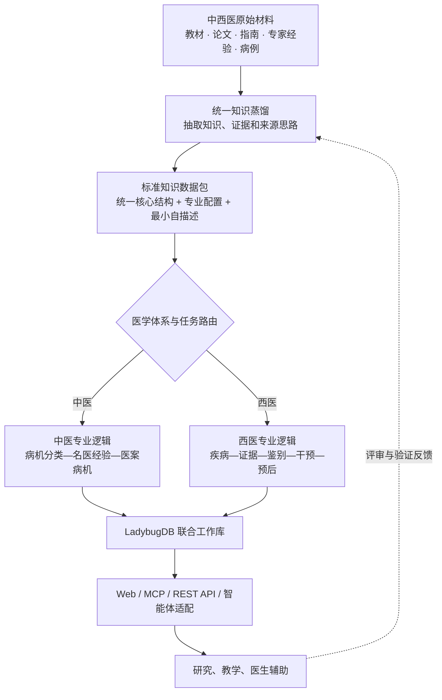
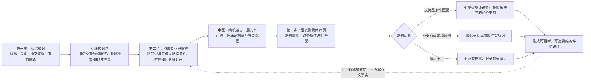
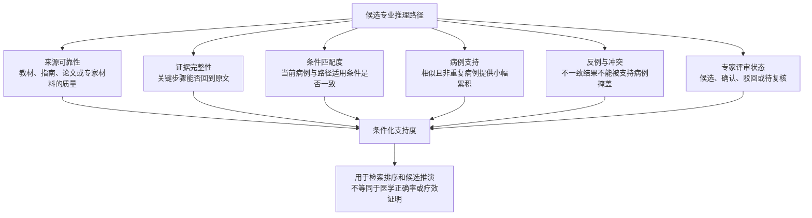

# 中西医知识蒸馏与智能体平台阶段进展记录

## 一、当前阶段概况

本阶段完成了项目方向梳理和需求基线固化。项目总体定位是面向中医和西医的医学知识精细化蒸馏与智能体平台，不是只服务于中医的单科工具。当前首先选择中医病机作为专业深化与论文验证主线，用它验证复杂知识、专家经验和病例推理能否被精细化构造与对齐；这属于首个重点场景，不代表平台的最终边界。

平台从中西医教材、论文、指南、专家经验、医案或临床病例中提取有原文依据的医学知识和可审计推理片段，形成能够按学科安装、组合、检索和推演的知识包。中医当前以病机为中轴，形成“通用病机分类—名医病机经验—医案个体病机”三层结构；西医按照疾病、危险因素、病理生理、临床表现、检查、诊断依据、鉴别诊断、治疗和预后等逻辑组织。二者共享证据、来源、关系、评审和版本能力，但不互相改写或强行合并理论概念。

平台定位为中西医知识研究、教学、医学材料整理和医生辅助工具，不作为自动诊断系统，也不面向患者直接开具处方或剂量。无论是中医病机推演，还是西医疾病鉴别与临床推理，都必须保留来源、不确定性和人工复核状态，不能把模型生成的推断伪装成教材原文、专家原意、指南结论或已经验证的医学事实。

## 二、项目整体结构已经确定

项目由通用医学知识构建、专业逻辑构造、知识存储、运行时推演、智能体接入、评审验证和医疗安全等部分组成。知识蒸馏 Skill 识别材料与医学体系，选择专业配置，抽取证据和知识，构造可审计推理路径并执行质量检查。中医病机三层对齐是当前重点；西医各科以后可增加疾病诊疗、临床决策和指南证据结构。医学知识进入可版本化、可交换的数据包，不堆积在 Skill 或提示词中。

核心平台独立于具体智能体环境运行，负责知识包管理、LadybugDB 工作库、联合检索、专业推理、权限、审计和评审。Web 端直接使用核心平台；Cursor、ChatGPT/Codex、DeepSeek Harness 等智能体环境通过 MCP、REST API、SDK 或各自的轻量适配方式接入。这样可以避免为每种智能体重新实现一套医学逻辑，也能保证不同环境使用同一批知识、评分和安全规则。

运行时智能体由医学知识包、专业推理策略、基础模型、上下文与记忆管理及医疗安全策略组成。中医专家角色表达辨证顺序、病机组合、鉴别和治法映射；西医专业角色表达病史、危险因素、检查证据、鉴别诊断、证据等级和风险判断。角色实现不是模仿语气，模型必须区分来源经验、通用知识和临时候选。

## 三、知识蒸馏产物的数据结构已经确定

本阶段已经固定蒸馏后数据包的逻辑结构。中西医教材、论文、指南、专家经验、医案和临床病例不使用彼此孤立的数据格式，而是共同遵守一套“统一核心结构”，再通过医学体系、专业科目和资料类型配置启用各自需要的内容。一本材料中同时包含理论、经验和病例时，可以同时启用多种配置，而不必拆成互不兼容的数据体系。

统一数据结构由九个部分组成：包自描述、来源与文档结构、证据对象、语义对象、关系对象、推理对象、专业专项对象、对齐对象以及质量与治理对象。前六部分及质量治理能力由中西医共同使用；专业专项对象负责承载不同医学体系不可互相替代的专业结构。

包自描述声明身份、版本、协议版本、医学体系、科目、资料类型、处理范围、质量、许可和完整性；来源与证据对象保存材料结构、原文、OCR 及准确位置；语义、关系和推理对象保存医学概念、断言、条件、时序、否定、陈述主体和思路片段。专业专项对象中，中医表达病因、病位、病性、病机、证候、四诊、治法、方药、转归及三层病机结构；西医表达疾病、危险因素、病理生理、症状体征、检查、诊断标准、鉴别诊断、干预、疗效和不良反应。对齐可以跨书、专家和病例，也可以建立有依据的中西医关联，但不能强行判定两套理论概念相同。质量与治理对象保存评审、错误、修订、覆盖缺口和数据血缘。

数据结构采用唯一证据层和多专业视图设计。原文证据只保存一份，通用知识视图以及中医病机推理视图、西医临床推理视图等专业视图共同引用它，避免为不同用途制造互相矛盾的事实副本。病例对某条推理路径产生的是特定条件下的经验支持，而不是简单加票；治疗后好转既不能直接证明中医病机正确，也不能脱离研究设计直接证明某项西医判断或干预具有普遍有效性。

### 知识—思维—病例的构建链路

这里的顺序已经固定：先蒸馏形成可以独立使用的知识包，再把知识和来源思路组织成专业推理路径，最后由病例对特定条件下的路径提供有限支持、反证或缺失信息。预先构造的思维链用于提高稳定性和可解释性；没有现成链路时，平台仍可以从知识包即时组合候选路径。

### 权重与可信状态

病例不是给某条链路简单“加一票”，系统也不使用一个无法解释的总权重。每条路径保存多个相互独立的支持维度：

病例带来的调整应当是小幅、可撤销并限定适用条件的。重复转载病例不能重复增加支持；系统用已有链路解释病例后，也不能把自己的解释再次回灌成新证据。专家确认提高的是审核状态和使用优先级，不会删除其他医家、其他指南或反例所表达的不同观点。

当前固定的是逻辑语义和产物边界，尚未提前锁定内部文件名、序列化格式、LadybugDB 节点表、关系表和字段类型。这为后续性能测试和实现优化保留空间，同时保证物理实现无论如何变化，都不能破坏来源追溯、三层关系和跨包兼容。

## 四、确定使用 LadybugDB 作为默认图数据引擎

平台已经确定使用 LadybugDB 作为默认嵌入式图数据引擎。选择它的主要原因是项目对“即插即用”要求较高：用户不应为了使用知识包额外安装 Neo4j、Java、Docker，或单独启动和维护数据库服务。LadybugDB 可以嵌入平台进程，以本地磁盘数据库保存属性图、中西医专业推理路径、来源证据、版本和审核状态，并可结合全文与向量检索能力支持大规模材料查询。

本项目过去使用过 Kuzu，其嵌入式、可复制和无需独立数据库服务器的思路与项目需求相符。但 Kuzu 原官方代码仓库已经归档，继续将其作为新项目的长期核心依赖，会增加后续维护、兼容和生态持续性的风险。因此，本项目保留原有的嵌入式技术路线，但将默认实现迁移到仍在持续发展的 LadybugDB。该选型属于部署与扩展方面的工程决策，不作为论文中的医学算法创新点；当前论文重点仍可放在中医病机知识的精细化蒸馏、三层结构自动构造和跨层对齐，而平台层面的研究与产物必须保留对西医知识包和专业逻辑的扩展能力。

知识数据包本身不直接等同于 LadybugDB 数据库文件。不同人员可以独立蒸馏中医或西医教材、论文、指南、专家经验和病例材料，生成可交换的数据包。数据包复制到约定位置后，平台负责自动发现、校验、暂存并纳入统一 LadybugDB 工作库，随后建立全文、向量和图索引以及跨包候选映射。联合查询可以按中医、西医、专科、资料类型或指定包限定范围；需要进行中西医联合检索时，也必须保留各自理论体系和证据边界。移除或停用某个包后，该包提供的内容和映射不再影响默认结果。

## 五、统一知识包协议已经确定

项目不采用“八个数据包配八本说明书”的方式，而是只维护一套项目级统一知识包协议“说明书”。这套说明书统一解释所有兼容数据包的数据对象、关系含义、资料类型配置、证据与推断边界、查询方法、质量状态、版本兼容、安装流程和医疗安全要求。

每个数据包只携带最小的机器自描述信息，而不附带另一套自然语言说明书。平台根据统一协议读取这些信息，即可判断数据包属于中医、西医或经过明确标注的交叉内容，适用于哪个科目，包含哪些资料类型和专业结构，采用哪个协议版本，是否完整以及是否允许启用。新增一本书、一位专家或一批病例时，只需要增加数据包，不需要修改核心 Skill、提示词或平台代码，也不需要重新告诉智能体如何理解这个包。

“复制即用”并不意味着不进行任何处理，而是指不需要人工重新配置。平台仍需自动执行协议版本检查、完整性和许可校验、导入、索引建立、跨包映射和状态切换。只有结构兼容并通过质量与安全检查的数据包才能进入正式查询；不兼容或不完整的数据包进入隔离区并给出原因，不能由模型临时猜测其结构。

## 六、当前完成度与下一阶段工作

目前已经确定中西医平台总体边界、知识蒸馏流程、统一数据结构、知识包协议、LadybugDB、多包查询、跨环境接入和医疗安全边界，并将中医病机三层结构确定为当前重点专业方案。中西医兼容是平台级目标，中医病机是当前研究主线，二者层级不同。

下一阶段应设计物理 Schema、数据包封装格式和导入校验规则，明确通用核心、中医扩展和西医扩展的边界。首个研究闭环仍可选择一个中医专科、一位名医和一批医案，验证病机抽取、三层对齐、来源回溯和异地复制即用；同时准备小型西医样本做兼容测试，防止底层协议被写死为只能表达中医。

现阶段不宜立即铺开中西医全部科目，也不应单纯以数据数量作为效果保证。项目应优先证明：同一套协议能够稳定蒸馏中西医不同类型材料，不同医学体系可以共享基础能力而保留专业逻辑；中医三层病机结构能够自动构造且可以审计；多个数据包能够无额外说明地联合使用。论文实验可重点评价系统相对普通文档检索或普通 RAG 在病机还原、医家经验隔离和病例推演方面的改进，平台验收则同时检查西医知识不会被错误套入中医病机结构。

## 七、本轮导师意见形成的新增基线

根据导师发送的方剂 Skill 记录和后续沟通，项目补充两项正式需求。

第一，方剂采用组合式 Skill。一个方剂对应一个 FormulaSkill，内部包含方剂识别、病机解释、药物层、加减、状态转移、停调、方剂选择和方剂比较。药物层不拆成每味药一个独立顶层 Skill，而由一个 DrugLayerSkill 统一管理整方多味药。单味药固有属性可以跨方复用，剂量、炮制、方中角色、配伍关系和条件规则必须保留方剂上下文。

第二，后训练正式加入项目长期周期，但当前不设计或执行具体训练。它未来用于提高模型执行结构化任务、调用检索与评审工具、区分原文和推断并遵守安全边界的稳定性，不负责存放全部医学知识。现阶段先把智能体结构、蒸馏结构、FormulaSkill、统一药物层和核心链跑通，并持续保留证据血缘、专家修订、错误类型、许可和可复现基线。

当上述结构能够端到端稳定运行后，项目冻结当时的真实快照，由 AI 根据实际任务接口、数据、模型、部署环境、算力和错误分布生成《后训练实施与验收方案》。方案需要明确如何构造和划分数据、选择训练方法、安装训练环境、设置验收指标、执行安全测试、灰度和回滚。只有经过项目负责人、医学专家和安全治理审核后，AI 才能按批准方案安装工具并执行后训练。

本轮更新后的规范入口是 [md/README.md](md/README.md)，详细方案见 [md/13-方剂药物层与后训练方案.md](md/13-方剂药物层与后训练方案.md)。
